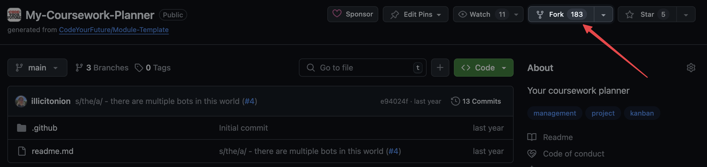
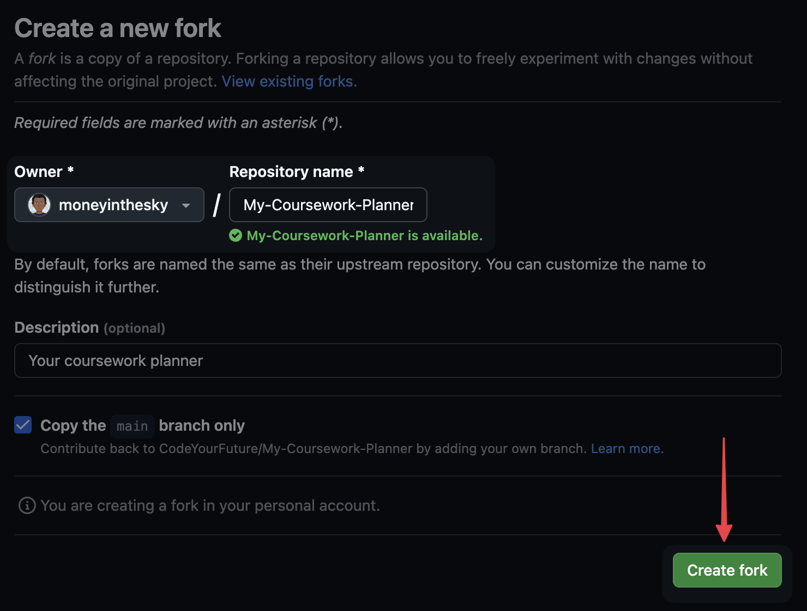
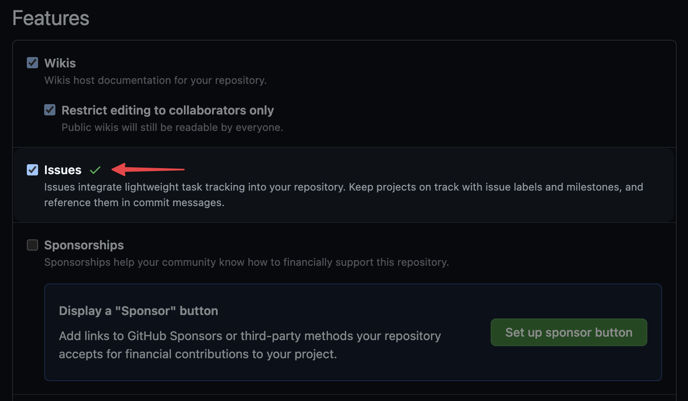
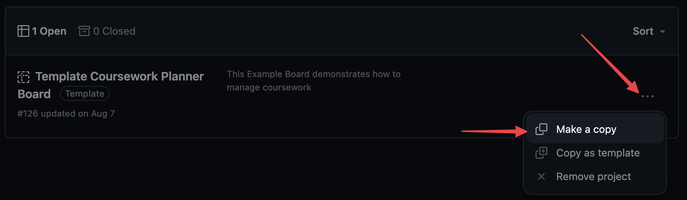
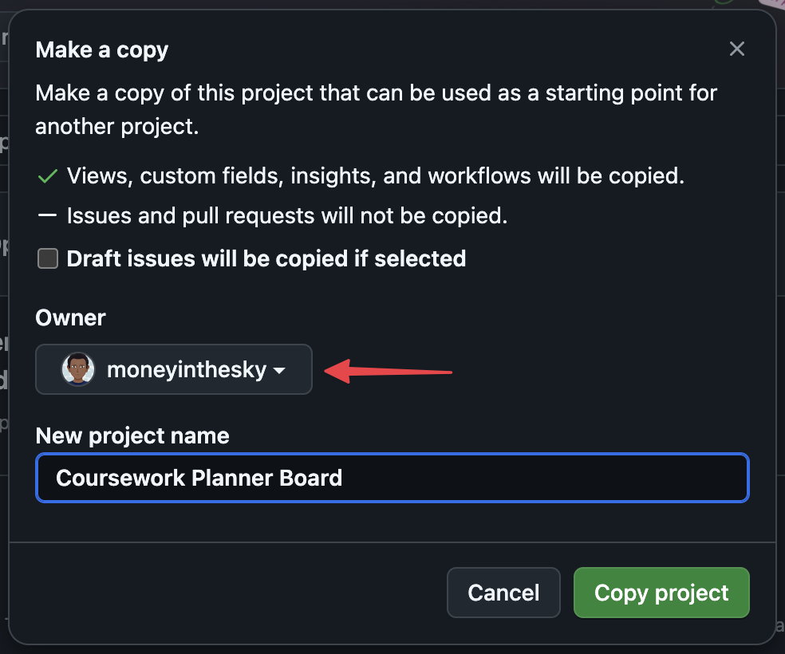
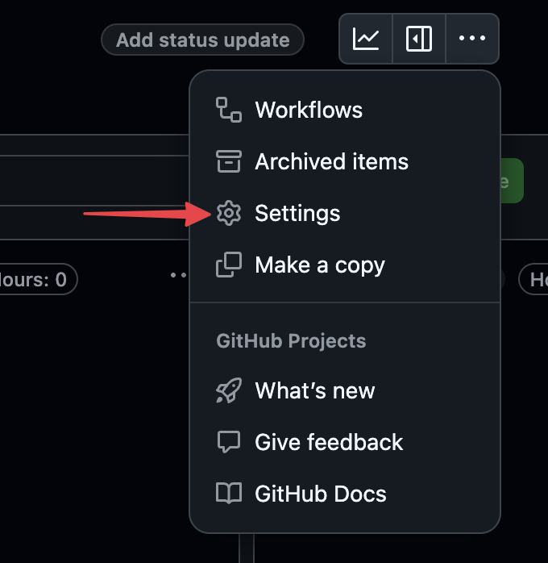
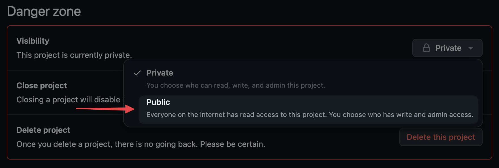
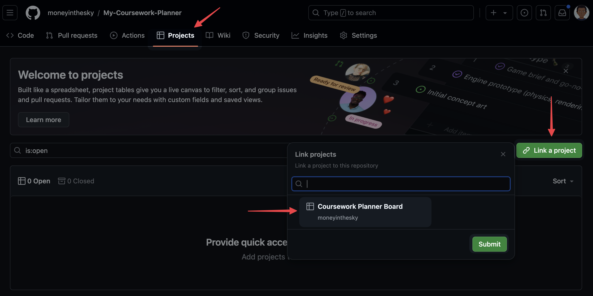

# Welcome to your coursework planner

This is how you will plan and manage your coursework at CYF. You will add all your work as issues to your fork of this repository, and then use a [project board](https://github.com/CodeYourFuture/My-Coursework-Planner/projects?query=is%3Aopen) to manage your work. This is broadly how all technical projects are managed, so you will need lots of practice. Get started today.

## 1. How to get set up

#### Forking the My-Coursework-Planner repo

1. Fork [this repo](https://github.com/CodeYourFuture/My-Coursework-Planner/) to your own GitHub

You should see your own GitHub username under `Owner`

2. Turn on `issues` in the `Settings` of your forked version of the repo

***You must fork to your personal Github account. Forks created in the CYF org will be deleted by a bot.***

#### Creating your project board

1. Go to the [example project board](https://github.com/CodeYourFuture/Coursework-Planner/projects?query=is%3Aopen)
2. Click the three-dot menu, and then select `Make a copy`

Make sure your own GitHub username is under `Owner`

3. Make your project board public so your mentors can see your progress
Open the project board settings

Scroll to the bottom to find the setting to make your board public

#### Linking the My-Coursework-Planner repo to your project board
1. Go back to your forked version of the My-Coursework-Planner repo
2. Under `Projects`, click `Link a project` and select your project board.

3. That's it! You're ready to start adding issues to your board!

## 2. In every module, you will add your work as issues

Each sprint in each module has a Backlog page which lists the work you're expected to do for that module. Every item in the list is actually a GitHub issue.

There is a "Clone" button next to each issue. When you're starting a sprint, clone each of its issues into your coursework planner.

Copy issues for each week or at most for each module. The coursework content is updated frequently, you will not have the most up to date tasks on your board if you copy all modules at once.

If the Clone button isn't working, expand this for instructions of how to manually clone the issues

Each module has a module repo. The coursework for each module is added as issues to that repository. All the module repos are listed in the [Table of Contents](https://github.com/CodeYourFuture/Table-of-Contents).

1. Go to the module repo
2. Click on the `Issues` tab
3. Copy each issue from the module repo to your own coursework repo.

We have also used the [Kamino Clone Button](https://chrome.google.com/webstore/detail/kamino/ffdebockfdjileaojbbccofhgncmioaf?hl=en) Chrome extension to make this easier, so you could try that.

## 3. Manage and adapt your project board as you learn

There are example project boards attached to each module, showing you ways you can use boards to manage your time, prioritise, scope, and track your work. You should use the _same project board_ all the way through the course, and add to it as you go. Learn as you go, and adapt your board as you learn.

You can, and should, also add your own tickets to the board. Just remember it's a public board, so don't add anything you don't want to share with your mentors.

You can watch [this video](https://www.loom.com/share/825be2e98a5046339500449dbf86ff01) about how to create your coursework-planner board.
